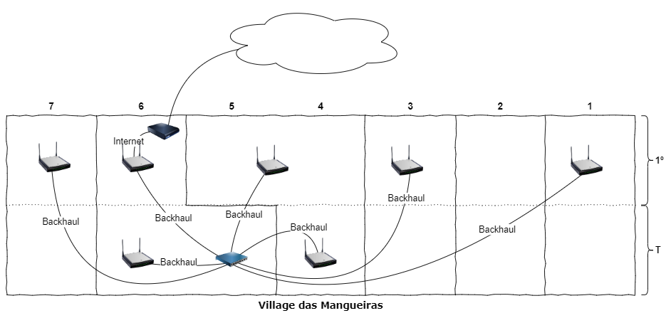

# Wi-Fi Mangueiras

## Projeto

### Esboço

### Quantitativo

|  #  | Item                | Unidade | Qt  |
| :-: | ------------------- | ------- | :-: |
|  1  | Access Point        | Un      |  7  |
|  2  | Switch 8 portas     | Un      |  1  |
|  3  | Cabo UTP Cat6       | Cx      |  1  |
|  4  | Conector Cat6 macho | Un      | 20  |

### Requisitos

1. :material-wifi::material-numeric-6-circle: Wi-Fi 6 (802.11ax)
2. :octicons-number-16: Suporte a 7 unidades
3. :material-virus-outline: Antivírus
4. :simple-letsencrypt: Criptografia WPA3
5. :material-wifi: Rede para IoT
6. :material-cable-data: Backhaul ethernet

## Comparativo

|                                     Requisitos                                     |                   [D-Link COVR-110x]                    |                [intelbras Twibi Force AX]                 |                         [TP-Link Deco S7]                         |                    [TP-Link Deco M5]                    |                    [TP-Link Deco X20]                     |                        [TP-Link Deco X50]                        |
| :-----------------------------------------------------------------------------: | :-----------------------------------------------------: | :-------------------------------------------------------: | :---------------------------------------------------------------: | :-----------------------------------------------------: | :-------------------------------------------------------: | :--------------------------------------------------------------: |
|      :material-wifi::material-numeric-6-circle:**E** ~802.11ax~ **6Hz**      |                         **✘**                          |                          **✘**                           |                              **✘**                               |                         **✘**                          |                          **✘**                           |                              **✘**                              |
| :material-wifi::material-numeric-6-circle: ~802.11ax~ **5GHz** **2.4GHz** |                         **✘**                          | **AX1500** 1200 Mbps (802.11ax) 300 Mbps (802.11ax) |                              **✘**                               |                         **✘**                          | **AX1800** 1201 Mbps (802.11ax) 574 Mbps (802.11ax) | **AX3000** 2402 Mbps (802.11ax, HE160) 574 Mbps (802.11ax) |
| :material-wifi::material-numeric-5-circle: ~802.11ac~ **5GHz** **2.4GHz** | **AC1200** 866 Mbps (802.11ac) 300 Mbps (802.11n) |                          **✔**                           | **AC1900** 1300 Mbps (802.11ac) 2.4 GHz: 600 Mbps (802.11n) | **AC1300** 867 Mbps (802.11ac) 400 Mbps (802.11n) |                          **✔**                           |                              **✔**                              |
|                     :octicons-number-16: **Máximo de unidades**                      |                            3                            |                            2+                             |                                 6                                 |                            6                            |                            6+                             |                                6+                                |
|                         :material-ethernet: **WAN/LAN**                         |                         2 x 1Gb                         |                          2 x 1Gb                          |                              3 x 1Gb                              |                         2 x 1Gb                         |                          2 x 1Gb                          |                             3 x 1Gb                              |
|                     :material-virus-outline: **Antivírus**                      |                         **✘**                          |                          **✘**                           |                              **✘**                               |                    TP-Link HomeCare                     |                    TP-Link HomeShield                     |                        TP-Link HomeShield                        |
|                   :simple-letsencrypt: **Criptografia WPA3**                    |                         **✔**                          |                          **✔**                           |                              **✘**                               |                         **✘**                          |                          **✔**                           |                              **✔**                              |
|              :material-wifi: **Redes** Principal Convidado IoT               |             2 **✔** **✔** **✘**             |              2 **✔** **✔** **✘**              |                  2 **✔** **✔** **✘**                  |             3 **✔** **✔** **✔**             |              3 **✔** **✔** **✔**              |                 3 **✔** **✔** **✔**                  |
|                   :material-cable-data: **Backhaul Ethernet**                   |                         **✔**                          |                          **✔**                           |                              **✔**                               |                         **✔**                          |                          **✔**                           |                              **✔**                              |

## Provedores

| Provedor  |          500MB           |          600MB           |          900MB           |
| :-------- | :----------------------: | :----------------------: | :----------------------: |
| **Core3** |            -             | R$ 110 ^0,18^ ^R$/MB^ |            -             |
| **GNET**  | R$ 130 ^0,26^ ^R$/MB^ |            -             | R$ 200 ^0,23^ ^R$/MB^ |

## Referências

### Wi-Fi

|     Generation     | IEEE standard | Adopted | Maximum link rate (Mbit/s) | Radio frequency (GHz) |
| :----------------: | :-----------: | :-----: | :------------------------: | :-------------------: |
|      Wi-Fi 7       |   802.11be    | (2024)  |       1376 to 46120        |      2.4 / 5 / 6      |
|      Wi-Fi 6E      |   802.11ax    |  2020   |      574 to 9608[^1]       |         6[^2]         |
|      Wi-Fi 6       |               |  2019   |                            |        2.4 / 5        |
|      Wi-Fi 5       |   802.11ac    |  2014   |        433 to 6933         |         5[^3]         |
|      Wi-Fi 4       |    802.11n    |  2008   |         72 to 600          |        2.4 / 5        |
|  _`Wi-Fi 3`_[^4]   |    802.11g    |  2003   |          6 to 54           |          2.4          |
|                    |    802.11a    |  1999   |                            |           5           |
|  _`Wi-Fi 2`_[^4]   |    802.11b    |  1999   |          1 to 11           |          2.4          |
|  _`Wi-Fi 1`_[^4]   |    802.11     |  1997   |           1 to 2           |          2.4          |

> Fonte: [Wikipedia]

### Links

[TP-Link IoT Network](https://community.tp-link.com/en/home/stories/detail/501928)  
[General questions about Ethernet Backhaul feature on your Deco](https://www.tp-link.com/us/support/faq/1794/)  
[Diferentes modelos Deco podem trabalhar juntos?](https://www.tp-link.com/br/support/faq/2248/)  
[Quantas unidades Deco posso acrescentar na minha rede?](https://www.tp-link.com/br/support/faq/1588/)  
[WPA3 Segurança Mais Forte Para Sua Rede](https://www.tp-link.com/br/wpa3/)  
[LiteWave Switches Não Gerenciáveis](https://www.tp-link.com/br/landing-page/litewave-switch/)  
[Tecnologia TP-Link Mesh](https://www.tp-link.com/br/mesh/)  
[WLAN/Wi-Fi](https://www.teleco.com.br/wifi.asp)  

### Notas

[^1]: MCS table (updated with 802.11ax data rates) <https://semfionetworks.com/blog/mcs-table-updated-with-80211ax-data-rates/>.
[^2]: Wi-Fi 6E is the industry name that identifies Wi-Fi devices that operate in 6 GHz. Wi-Fi 6E offers the features and capabilities of Wi-Fi 6 extended into the 6 GHz band.
[^3]: 802.11ac only specifies operation in the 5 GHz band. Operation in the 2.4 GHz band is specified by 802.11n.
[^4]: Wi-Fi 1, 2, and 3 are by retroactive inference.

[D-Link COVR-110x]: https://www.dlink.com.br/produto/covr-1100-ac1200-sistema-wi-fi-mesh-dual-band/
[intelbras Twibi Force AX]: https://www.intelbras.com/pt-br/roteador-mesh-ax-1500-twibi-force-ax
[Switch Gigabit de Mesa com 8 portas (TP-Link LS108G)]: https://www.amazon.com.br/Switch-Gigabit-Mesa-Portas-Ls108G/dp/B07RQT8VX1?th=1
[TP-Link Deco M5]: https://www.tp-link.com/br/home-networking/deco/deco-m5/  
[TP-Link Deco S7]: https://www.tp-link.com/br/home-networking/deco/deco-s7/  
[TP-Link Deco X20]: https://www.tp-link.com/br/home-networking/deco/deco-x20/  
[TP-Link Deco X50]: https://www.tp-link.com/br/home-networking/deco/deco-x50/  
[Wikipedia]: https://en.wikipedia.org/wiki/Template:Wi-Fi_generations "Wi-Fi generations"
